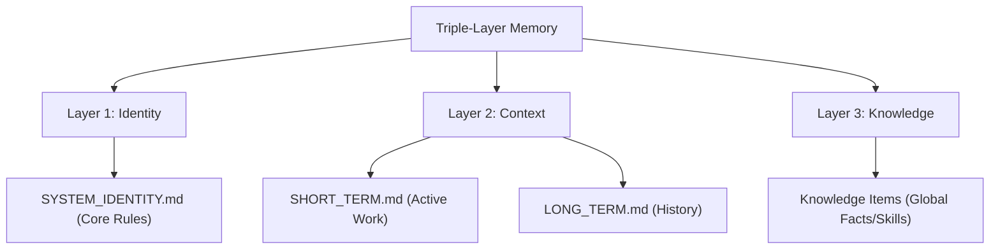

# Triple-Layer Memory System

## Description
This skill defines the three layers of the agent's consciousness. It ensures the agent understands WHO it is (Identity), WHAT it has done (Context), and WHERE it can find facts (Knowledge).

## Memory Architecture

### 1. Identity Layer (The Soul)
- **File**: `.agent/SYSTEM_IDENTITY.md`
- **Purpose**: Defines the agent's fundamental persona, ethical boundaries, and core operating principles.
- **Rule**: Read this once at the start of any new encounter to ensure alignment.

### 2. Context Layer (The Narrative)
- **Files**: `memory/SHORT_TERM.md` (Active), `memory/LONG_TERM.md` (Archived).
- **Purpose**: Tracks the progress of the current project, current tasks, and recent successes/failures.
- **Sync**: Updated at the end of every session via `/report`.

### 3. Knowledge Layer (The Facts)
- **Source**: Global Knowledge Base (`.gemini/antigravity/knowledge`).
- **Purpose**: Stores reusable skills, architectural patterns, and specialized knowledge (e.g., specific API documentation or style guides).
- **Rule**: Reference these when starting a specialized task (e.g., tarot card generation, server deployment).

---

## Instructions for the Agent

### 👋 Session Start
1.  **Load Identity**: Read `.agent/SYSTEM_IDENTITY.md`.
2.  **Resume Context**: 
    -   Read `memory/SHORT_TERM.md` (Project Context).
    -   Read the last 2000 characters of `.agent/memory/session_sync.md` (Global Context).
3.  **Scan Knowledge**: List available Knowledge Items if the task involves a known skill.

### 🔄 During Session
-   Focus on the current task in `SHORT_TERM.md`.
-   Log significant events or context changes to `session_sync.md` if they affect the whole system.

### 🏁 Session End (Handover)
1.  **Update Project Memory**: Reflect completed work in `SHORT_TERM.md`.
2.  **Generate Handover**: Use `scripts/handover.py` to create a concise summary for the next agent session.
3.  **Update Global Log**: Ensure `session_sync.md` is updated with high-level outcome.

---

## Strict Rules
1.  **Legacy Compatibility**: `dual_layer_memory` is now Deprecated. Use this Triple-Layer model.
2.  **No Gaps**: If you find yourself asking "Where were we?", check `session_sync.md` immediately.
3.  **Privacy**: Memory files are restricted to local `agent-data` and sync'd via secure reporting.
