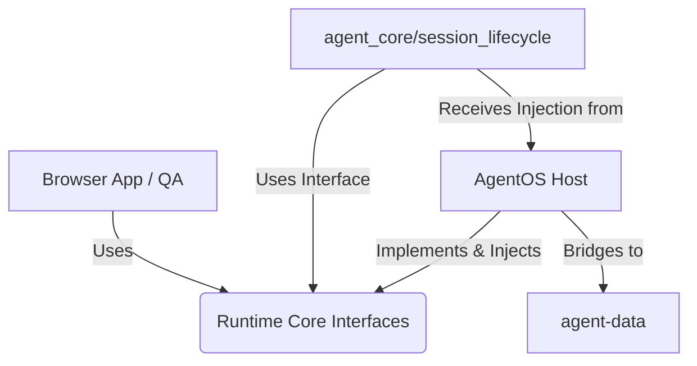

# AgentOS Architecture Refactor: Phase 1 & 2.5 (Core, Host, Browser)

## 1. 三層責任邊界 (The Three Layers)

為了讓 AgentOS 具備高度可攜性，並能完美支援如 scriptless-qa-agent 的瀏覽器自動化任務，我們將系統切割為三個明確的邊界：

### A. Runtime Core (可攜式核心)
- **職責**：定義純粹的 Agent 狀態機、Session 管理、Checkpoint 機制與 Executor 介面。這是一層完全抽象的邏輯，**不知道**自己跑在什麼作業系統、是不是在 AgentOS 中，也沒有具體的檔案路徑依賴，亦不理解特定 markdown 的結構。
- **組件**：`SessionContext` (structured data), `CheckpointEvent`, `ExecutorInterface`, `ContextProviderInterface` (提供 `load_context()` 與 `persist_session_close()`).
- **依賴限制**：不能依賴任何 `agentos_host` 或 `browser_app` 的模組。只能依賴 Python 標準庫。

### B. AgentOS Host (主機與生態系適配器)
- **職責**：將 Runtime Core 綁定到現有 AgentOS 的生態系中。負責解析、生成 AgentOS 特有的 `STATUS.md`、`SHORT_TERM.md` 等 markdown 結構，處理 `memory/` 軟連結橋接 (Symlink Bridge)、Dashboard 註冊與 IDE 整合。
- **組件**：`AgentOSContextAdapter` (封裝檔案 I/O, Git 狀態, markdown string parsing，實作 `ContextProviderInterface`).
- **依賴限制**：依賴並實作 `runtime_core` 定義的 Interface。這層是 AgentOS 專屬的 host 環境邏輯。

### C. Browser App / Scriptless QA (瀏覽器執行器)
- **職責**：專注於 Playwright 控制、DOM 樹解析、視覺任務執行。
- **組件**：`BrowserExecutor` (實作 `ExecutorInterface`)。
- **依賴限制**：依賴 `runtime_core` 的 Task/Executor 介面，但不應該直接依賴 `agentos_host` (這允許 Scriptless QA 在沒有 AgentOS 完整依賴的情況下運行，只要有 Runtime Core 即可)。

## 2. 依賴方向 (Dependency Direction)

**絕對禁止的反向依賴**：
- `runtime_core` **不可** import 任何 `agentos_host` 或是 `scripts/` 的東西。
- `agent_core.session_lifecycle` **不可** 預期或依賴特定的檔案路徑及 markdown 格式（皆交由 `AgentOSContextAdapter` 注入）。
- `runtime_core` **不可** 預設存在 `/home/ubuntu/agent-data/` 的實體路徑。

## 3. 實踐與邊界現狀 (Phase 2.5 Status)

- **已解耦**：`session_lifecycle.py` 不再讀取檔案或解析 `SHORT_TERM.md` / `STATUS.md`，這些都已轉移至 `AgentOSContextAdapter` 並轉換為 `SessionContext` 的結構化資料。
- **依賴注入**：呼叫端（如 `scripts/handover.py`, `scripts/run_workflow.py`）會主動建立 `AgentOSContextAdapter` 並將其注入 `close_session`。`agent_core.session_lifecycle.py` 內部不再反向引用 `agentos_host`。

### Residual Risks & Next Steps
- **Platform Driver 殘留**：`session_lifecycle.py` 和 `adapter.py` 仍有少許與 `platform` (OS/Symlink drivers) 的互動需要持續收斂。
- **Session ID 產生與狀態機**：`close_session` 本身仍負責產生 UUID 以及寫入 `sessions/*.yaml` 與 `session_sync.md`，未來可考慮進一步將 `_append_session_sync` 邏輯也移交給 host adapter 處理，確保核心純粹只處理邏輯流程，不涉及實體檔系統寫入。
- **下一步建議**：實作 `BrowserExecutor` (Phase 3)，並驗證 `scriptless-qa-agent` 是否能利用乾淨的 `runtime_core` 運作。
