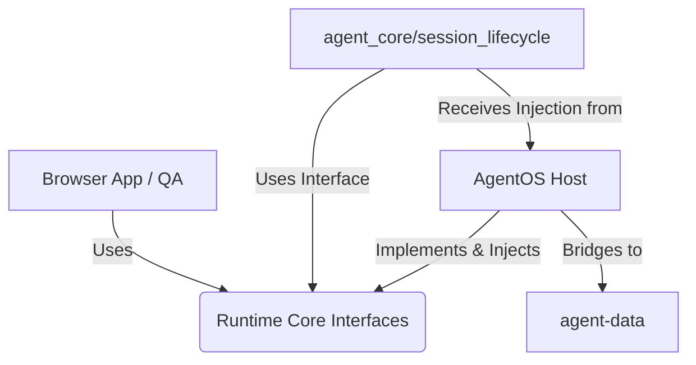

# AgentOS Architecture Refactor: Phase 1 to 2.6 (Core, Host, Browser)

## 1. 三層責任邊界 (The Three Layers)

為了讓 AgentOS 具備高度可攜性，並能完美支援如 scriptless-qa-agent 的瀏覽器自動化任務，我們將系統切割為三個明確的邊界：

### A. Runtime Core (可攜式核心)
- **職責**：定義純粹的 Agent 狀態機、Session 管理、Checkpoint 機制與 Executor 介面。這是一層完全抽象的邏輯，**不知道**自己跑在什麼作業系統、是不是在 AgentOS 中，也沒有具體的檔案路徑依賴，亦不理解特定 markdown 的結構，不決定 host persistence 的儲存路徑。
- **組件**：`SessionContext` (structured data), `CheckpointEvent`, `ExecutorInterface`, `ContextProviderInterface` (提供 `load_context()` 與 `persist_session_close()`).
- **依賴限制**：不能依賴任何 `agentos_host` 或 `browser_app` 的模組。只能依賴 Python 標準庫。

### B. AgentOS Host (主機與生態系適配器)
- **職責**：將 Runtime Core 綁定到現有 AgentOS 的生態系中。負責解析、生成 AgentOS 特有的 `STATUS.md`、`SHORT_TERM.md`、`session_sync.md` 等 markdown 結構，決定 Session YAML record 存放的位置、歸檔 (archive rollover) 慣例，以及處理 `memory/` 軟連結橋接 (Symlink Bridge)、Dashboard 註冊與 IDE 整合。
- **組件**：`AgentOSContextAdapter` (封裝檔案 I/O, Git 狀態, markdown string parsing, artifact pathing，實作 `ContextProviderInterface`).
- **依賴限制**：依賴並實作 `runtime_core` 定義的 Interface。這層是 AgentOS 專屬的 host 環境邏輯。

### C. Browser App / Scriptless QA (瀏覽器執行器)
- **職責**：專注於 Playwright 控制、DOM 樹解析、視覺任務執行。
- **組件**：`BrowserExecutor` (實作 `ExecutorInterface`)。
- **依賴限制**：依賴 `runtime_core` 的 Task/Executor 介面，但不應該直接依賴 `agentos_host` (這允許 Scriptless QA 在沒有 AgentOS 完整依賴的情況下運行，只要有 Runtime Core 即可)。

## 2. 依賴方向 (Dependency Direction)

**絕對禁止的反向依賴**：
- `runtime_core` **不可** import 任何 `agentos_host` 或是 `scripts/` 的東西。
- `agent_core.session_lifecycle` **不可** 預期或依賴特定的檔案路徑及 markdown 格式（皆交由 `AgentOSContextAdapter` 注入）。
- `runtime_core` **不可** 預設存在 `/home/ubuntu/agent-data/` 的實體路徑。

## 3. 實踐與邊界現狀 (Phase 2.6 Status - Hard Gate Cleanup)

- **已徹底解耦**：`session_lifecycle.py` 不再知道任何 AgentOS 的 artifact 命名（如 `STATUS.md`、`session_sync.md`）、不再知道任何 host 的目錄存放政策（如 `sessions/`、`archive/` 輪替）。
- **真正的 Portable Core**：`session_lifecycle` 現在只負責建構與產生 Session Record payload (Dictionary)，並呼叫 `context_provider.persist_session_close(record)`，由 host 決定寫檔的細節、產生對應的 Markdown string (compact entry) 與具體的 record URI 回傳。
- **移除假抽象**：原本無用的 `SessionManagerInterface` 與 `AgentOSSessionAdapter` 已被刪除，讓介面設計真正貼合當前需求：Core 僅需 `ContextProviderInterface` 進行 load 與 persist。

### Residual Risks & Next Steps
- **Platform Driver 殘留**：`adapter.py` 仍有少許與 `platform` (OS/Symlink drivers) 的互動，這不違反 portable core，但屬於 host 層級尚未完全收斂到統一介面的歷史共業。
- **下一步建議**：開始實作 `BrowserExecutor` (Phase 3)，並驗證 `scriptless-qa-agent` 是否能直接利用這個乾淨的 `runtime_core` 運作。
