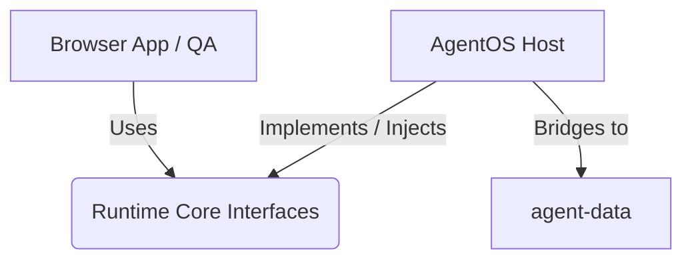

# AgentOS Architecture Refactor: Phase 1 (Core, Host, Browser)

## 1. 三層責任邊界 (The Three Layers)

為了讓 AgentOS 具備高度可攜性，並能完美支援如 scriptless-qa-agent 的瀏覽器自動化任務，我們將系統切割為三個明確的邊界：

### A. Runtime Core (可攜式核心)
- **職責**：定義純粹的 Agent 狀態機、Session 管理、Checkpoint 機制與 Executor 介面。這是一層完全抽象的邏輯，**不知道**自己跑在什麼作業系統、是不是在 AgentOS 中，也沒有具體的檔案路徑依賴。
- **組件**：Session Model, Checkpoint Protocol, Executor Interface, Context Provider Interface.
- **依賴限制**：不能依賴任何 `agentos_host` 或 `browser_app` 的模組。只能依賴 Python 標準庫。

### B. AgentOS Host (主機與生態系適配器)
- **職責**：將 Runtime Core 綁定到現有 AgentOS 的生態系中。處理 `STATUS.md`、`memory/` 軟連結橋接 (Symlink Bridge)、Dashboard 註冊與 IDE 整合。
- **組件**：`AgentOSContextAdapter` (讀寫 SHORT_TERM.md), `AgentOSSessionAdapter` (調用 session_lifecycle).
- **依賴限制**：依賴並實作 `runtime_core` 定義的 Interface。這層是 AgentOS 特有的。

### C. Browser App / Scriptless QA (瀏覽器執行器)
- **職責**：專注於 Playwright 控制、DOM 樹解析、視覺任務執行。
- **組件**：`BrowserExecutor` (實作 `ExecutorInterface`)。
- **依賴限制**：依賴 `runtime_core` 的 Task/Executor 介面，但不應該直接依賴 `agentos_host` (這允許 Scriptless QA 在沒有 AgentOS 完整依賴的情況下運行，只要有 Runtime Core 即可)。

## 2. 依賴方向 (Dependency Direction)

**絕對禁止的反向依賴**：
- `runtime_core` **不可** import 任何 `agentos_host` (例如 `agent_core.session_lifecycle`) 或是 `scripts/` 的東西。
- `runtime_core` **不可** 預設存在 `/home/ubuntu/agent-data/` 的實體路徑。

## 3. 未來擴展 (Scriptless QA Agent Integration)
透過抽出 `ExecutorInterface` 與 `CheckpointEvent`：
1. `scriptless-qa-agent` 會提供一個 `BrowserExecutor` 給 `runtime_core`。
2. 每次瀏覽器點擊或 DOM 狀態改變，會拋出 `CheckpointEvent`。
3. `AgentOSContextAdapter` 會捕捉這些事件，並轉寫成 AgentOS 特有的 `STATUS.md` 與 `SHORT_TERM.md` 格式。
4. 這樣 Scriptless QA 的核心碼可以維持純淨，而 AgentOS 也能收集到需要的 Log。
