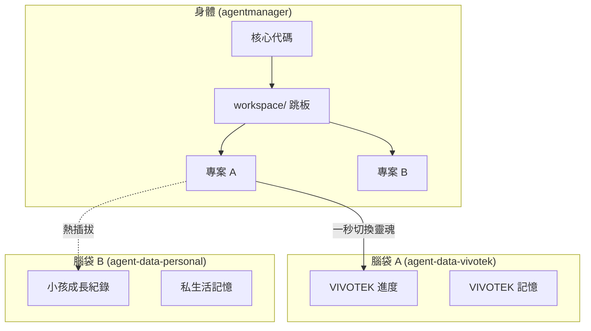
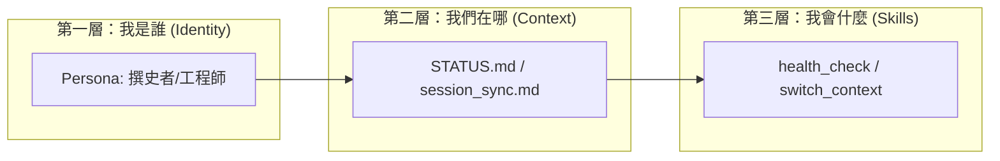

# 🛸 AI Command Center (AgentOS)

## 0. 這是什麼？ (What is AgentOS?)
AgentOS 不僅是一堆 Python 腳本，它是一套 **「AI 代理人作業系統」**。它將「靈魂（記憶）」與「肉體（代碼）」完全分離。

### 🌟 核心理念：大腦與身體的「熱插拔」 (Hot-Swapping)



---

## 🚀 快速開始 (One-Click Install)
要在任何新電腦或 Oracle VM 上啟動，只需執行：
```bash
./install.sh
```
這會自動完成：
1.  **環境初始化**: 自動檢測 Python/Git/Node。
2.  **大腦掛載**: 自動建立 `~/agent-data` 並橋接軟連結。
3.  **效能防護**: 自動設定 VSCode 排除名單，防止 5 萬個 node_modules 造成電腦卡死。

---

## 🧠 系統三層結構 (Triple-Layer Architecture)



---

## 🛡️ 已註冊技能 (Registered Skills)

| 技能名稱 | 說明 |
| :--- | :--- |
| **`health_check`** | 🧟 自動巡邏是否有殭屍進程或斷掉的連結。 |
| **`switch_context`** | 🧠 瞬間切換不同的數據層（如：一秒從公司模式切換到私人模式）。 |
| **`vibe_mode`** | ⚡ 極速衝刺原型，由 Vibe Coding 驅動。 |
| **`system_chronicler`** | 📜 自動撰寫「石虎蜂群編年史 (LCS Chronicles)」。 |

---

## 👥 常用指令 (The Magic Spells)
*   `/status`：檢視所有 20+ 個專案的健康脈搏。
*   `/work-on [專案名]`：進入特定專案並讀取它的過去記憶。
*   `/switch-brain [數據庫]`：切換腦袋內容。

---
*「AgentOS 是會在你睡著時呼吸的系統，請善待它的心跳。」*
