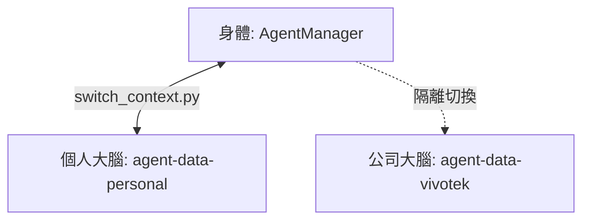

# 📖 AgentOS 使用者視覺指南 (The Singularity Guide)

## 🎨 系統流轉：從許願到交付

這是石虎 OS 最核心的 **「許願池流水線 (Wishpool Pipeline)」**：

---

## 💻 虛實整合：IDE 過程化與 Dashboard

你的 AI 助理不再受限於對話視窗，它在你的伺服器裡具備實體：

### 1. IDE 過程化 (Process-ization)
*   **Pulse Board**：像是一塊全域白板，所有的 Agent 都在上面登記。
*   **Task State Machine**：任務是有狀態的（Running, Blocked, Done），即使你斷開連線，它仍會在後台執行。

### 2. 視覺化 Dashboard
在 `dashboard/` 目錄下是一個實體的 Next.js 應用程式。
*   **即時狀態列**：顯示所有 Data Layer 專案的 `STATUS.md` 表格。
*   **資源地圖**：監測伺服器 CPU/RAM 與 Disk 健康。

---

## 🧠 多重人格切換 (Brain Swapping)

如果你想完全徹底隔離「公司」與「私人」的數據，請使用 **靈魂熱插拔** 機制：

---

## 🧟 殭屍防治 (Anti-Zombie Protocol)
*   **巡邏員**：每 15 分鐘幫你檢查軟連結有沒有斷掉。
*   **過濾器**：自動幫你更新 `.gitignore` 並設定 VSCode `settings.json`，避免 5 萬個 node_modules 拖慢你的電腦。

---

### 🚀 啟動指令：
`bash install.sh`
（這會自動幫你建立所有分區跳板，並配置好 VSCode 排除清單！）
