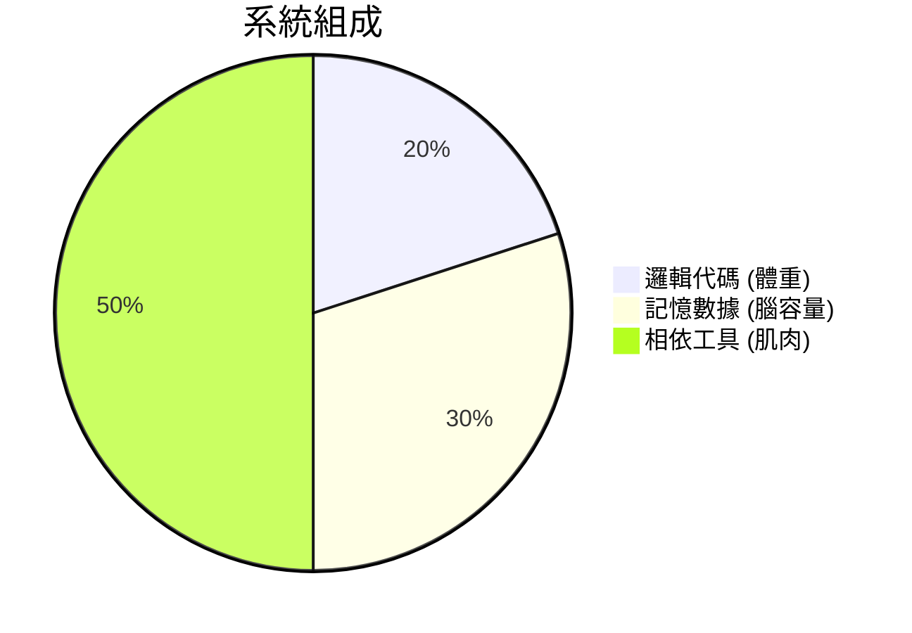
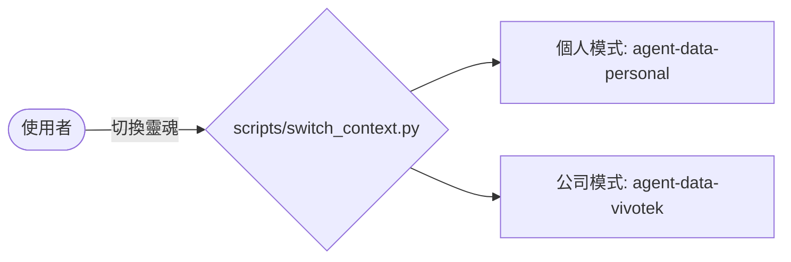

# 📖 AgentOS 麻瓜友善指南 (The Visual Guide)

## 🎨 核心視覺化架構
AgentOS 採用了「身首異處」的設計，這是為了保護你的腦袋（數據）即使在身體（伺服器）掛掉時也能生存。

### 1. 腦袋與身體的分離 (Brain-Body Separation)
你的電腦裡不應該只有一個專案，應該是多個專案共用一個「神經中樞」。

---

## 🛠️ 如何管理你的 Agent (數位員工)

### 👣 Step 1: 報到 (Install)
執行 `./install.sh`。就像給數位員工一個辦公桌與身分證（軟連結）。

### 👣 Step 2: 交付任務 (Register)
使用 `/add-project` 指令。這會給員工一個空筆記本 (`STATUS.md`)。

### 👣 Step 3: 工作中 (Execution)
你可以叫他用 **Vibe Mode (極速衝刺)** 或 **SDD Mode (規格嚴格版)**。

### 👣 Step 4: 交接報告 (Handover)
下班前輸入 `/report`。他會寫下他今天做了什麼，這樣下一個 Agent 接手時，腦袋才會有這段記憶。

---

## 🧟 殭屍防治 (Zombie Prevention)
有時候 Agent 會卡住（像你在開啟資料夾時遇到的情況）。
**Health Check (巡邏員)** 會每天定時：
1.  **檢查軟連結**: 如果路徑斷了，它會自動發送警告。
2.  **清理垃圾**: 自動檢查 `.gitignore` 是否有漏勾的 node_modules 巨獸。
3.  **心跳監視**: 確保後台的 Telegram Bridge 還活著。

---

## 🧠 多重人格切換 (Multi-Context Isolation)
如果你想從「石虎塔羅開發」切換到「公司專案」，你不需要重新開機：

這能確保你在公司絕對碰不到私人數據，在私人時間也不會不小心改到公司的進度。

---
### 💡 小撇步：
*   **VSCode 打不開？**: 看看 `.vscode/settings.json` 有沒有把垃圾排除。
*   **找不到專案？**: 去 `workspace/` 看看，那裡是所有專案的跳板總部。
