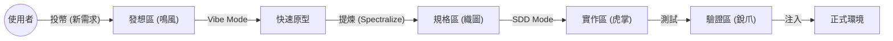
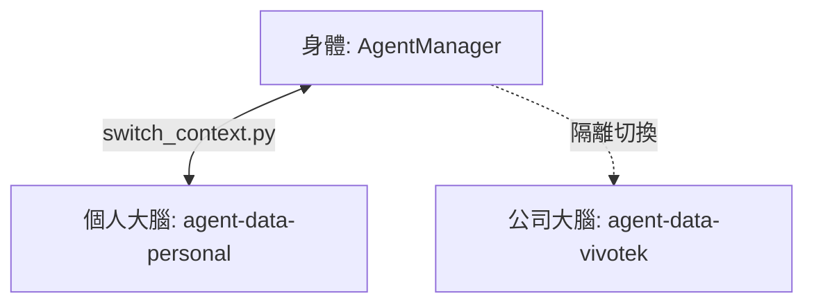

# 📖 AgentOS 使用者視覺指南 (The Singularity Guide)

## 🎨 系統流轉：從許願到交付

這是石虎 OS 最核心的 **「許願池流水線 (Wishpool Pipeline)」**：


```mermaid
graph LR
    User((使用者)) -- "投幣 (新需求)" --> Ideas["發想區 (鳴風)"]
    Ideas -- "Vibe Mode" --> Prototype[快速原型]
    Prototype -- "提煉 (Spectralize)" --> Specs["規格區 (織圖)"]
    Specs -- "SDD Mode" --> Impl["實作區 (虎掌)"]
    Impl -- "測試" --> Val["驗證區 (銳爪)"]
    Val -- "注入" --> Production[正式環境]
```

---

## 💻 虛實整合：IDE 過程化與 Dashboard

你的 AI 助理不再受限於對話視窗，它在你的伺服器裡具備實體：

### 1. IDE 過程化 (Process-ization)
*   **Pulse Board**：像是一塊全域白板，所有的 Agent 都在上面登記。
*   **Task State Machine**：任務是有狀態的（Running, Blocked, Done），即使你斷開連線，它仍會在後台執行。

### 2. 視覺化 Dashboard
在 `dashboard/` 目錄下是一個實體的 Next.js 應用程式。
*   **即時狀態列**：顯示所有 Data Layer 專案的 `STATUS.md` 表格。
*   **資源地圖**：監測伺服器 CPU/RAM 與 Disk 健康。

---

## 🧠 多重人格切換 (Brain Swapping)

如果你想完全徹底隔離「公司」與「私人」的數據，請使用 **靈魂熱插拔** 機制：


```mermaid
graph TD
    Logic[身體: AgentManager]
    SubNameA[個人大腦: agent-data-personal]
    SubNameB[公司大腦: agent-data-vivotek]

    Logic <--> |switch_context.py| SubNameA
    Logic -.-> |隔離切換| SubNameB
```

---

## 🧟 殭屍防治 (Anti-Zombie Protocol)
*   **巡邏員**：每 15 分鐘幫你檢查軟連結有沒有斷掉。
*   **過濾器**：自動幫你更新 `.gitignore` 並設定 VSCode `settings.json`，避免 5 萬個 node_modules 拖慢你的電腦。

---

## 🖥️ 專案管理指南：將外部專案添加至本地 workspace
當你需要下載一個本來不在這台電腦的專案來開發時，現在已經**完全自動化**，您只需在 `agentmanager` 目錄下執行**一條指令**即可：

```bash
python3 scripts/reconcile_workspace.py --add <專案名稱>
# 範例：python3 scripts/reconcile_workspace.py --add youtube-ai-manager
```

### 💡 背後運作的自動化流程：
1. **追加工作區設定**：自動在該專案於 Data Layer 的 `project.yaml` 中，將這台電腦的 `target_workspaces` 追加進去。
2. **自動 Git 下載**：自動拉取（git clone）該專案的程式碼至您的家目錄。
3. **建立 Symlink 記憶橋接**：自動建立專案的 `STATUS.md` 與 `memory/` 軟連結。
4. **重新生成 Workspace 檔**：自動觸發 `gen_workspace.py` 重新更新您的 VS Code 工作區檔案（如 `agentos.<workspace_name>.code-workspace`）。您只需重新載入 VS Code 即可開始開發！

> [!TIP]
> 如果您事後想把該專案從這台電腦的工作區中移除，只需執行：
> `python3 scripts/reconcile_workspace.py --remove <專案名稱>`

### 🤖 如何讓 AI 代理人自動處理專案管理（對 Agent 對話指南）
現在您完全不需要在終端機手動輸入任何指令！
由於 AgentOS 在 `.cursorrules` 與 `.aider.instructions.md` 中已經寫入了動態工作區管理的運作規則，因此當您想加入或移除專案時，**可以直接用語音或打字直接對著 AI Agent (如 Cursor / Aider / Antigravity) 下達指令**：

*   **新增專案 Prompt 範本**：
    > 「AI，請幫我把 `moltbot` 專案下載並加到這台電腦」
    > 「請把 `leopardcat-tarot` 加到這台電腦的工作區中」
    > 「幫我新增 `beauty-pk` 專案」
*   **移除專案 Prompt 範本**：
    > 「請幫我把 `moltbot` 從這台電腦的 workspace 移除」

**AI 代理人收到上述指令後，會自動在背景執行 `python3 scripts/reconcile_workspace.py --add <slug>`（或 `--remove`），並在完成後回報結果。**

---

## 🌐 連接埠管理指南 (Port Manager)
當您需要為新服務或專案分配一個未使用的通訊埠 (Port) 時，AgentOS 提供統一的 `Port Manager` 避免衝突。

### 🤖 如何讓 AI 代理人自動分配 Port（對 Agent 對話指南）
請直接對著 AI Agent (如 Cursor / Aider / Antigravity) 下達指令：
*   **分配 Port Prompt 範本**：
    > 「AI，請幫我為 `my-new-project` 專案分配一個新的 Port」
*   **查詢 Port Prompt 範本**：
    > 「請查詢目前系統有哪些被佔用的連接埠？」

**AI 代理人收到上述指令後，會自動在背景執行：**
`python3 scripts/core_services/port_manager.py allocate <專案名稱>`
這不僅能防止不同專案間的 Port 衝突，還會自動掃描作業系統確認該 Port 真的可用，並統一記錄在 `agent-data/config/port_registry.json` 中。

---

## 👥 人口與角色管理指南
為了確保 AI 代理人在進入專案時能完美「附身」並具備該專案的特化人格（例如塔羅牌專案的「山靈大師」），AgentOS 設計了以下角色機制：

### 1. 角色分類
*   **系統級角色 (System Roles)**：定義在 `.agent/roles/` 下（如 `lcs_the_claw` 爪、`lcs_the_paw` 掌等），負責底層開發、監控與協調工作。
*   **專案級角色 (Project Roles)**：散落在各專案目錄下的 `AGENTS.md`（如 `Hill Spirit Master`、`Zeus Writer`），定義了該專案的特有專家背景、寫作風格或專業提示詞。

### 2. 如何為專案分配角色
編輯專案在 Data Layer 的 `project.yaml` 檔案，在 `assigned_agents` 欄位填入指定角色的名稱（區分大小寫）：
```yaml
assigned_agents:
  - Hill Spirit Master
```
未來，當 AI 代理人透過 `/work-on [專案名]` 工作流進入開發時，控制端會自動讀取此設定，並將對應專案的人格與背景提示詞動態注入至當前 Context 中，防止角色背景遺失。

---

### 🚀 啟動指令：
*   **初次安裝與配置**：`bash install.sh`
*   **全局同步與更新**：`/sync` 或 `bash scripts/sync_brain.sh`
*   **重啟所有常駐服務**：`/reboot`
（這會自動幫你建立所有分區跳板，並配置好 VSCode 排除清單！）
