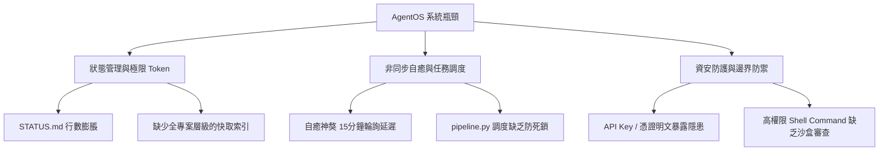

# AgentOS 冥想與系統改善建議計劃 (v1.0)

> [!NOTE]
> 本文件記錄了 2026-05-29 AI 核心針對 **AgentOS 運作實務**、**近期系統挑戰**及**潛在資安漏洞**所進行的全面性深度冥想，並提出了相應的「架構強化與資安防護計劃」。

---

## 🔍 一、 冥想摘要與現況剖析

在 AgentOS 逐步擴張至 **22 個專案** 的成長過程中，系統成功實踐了 **「邏輯與資料分離（Logic/Data Separation）」** 的核心哲學。透過 `/home/ubuntu/agent-data` 的軟連結虹橋（Symlink Bridge），極大地節省了上下文 Token 消耗，並將首字響應速度優化了數千倍。

然而，隨著生態系日益龐大，現有的系統架構與防護機制正暴露出以下三個核心維度的瓶頸與隱患：

---

## 🛠️ 二、 近期問題與痛點診斷

### 1. 狀態管理與極限 Token 的瓶頸
- **痛點**：雖然移除了 `node_modules` 灰色毒瘴的索引，但隨著專案進展，`agent-data/projects/[project]/STATUS.md` 本身的行數與 Activity Log 仍在無限制膨脹。在長對話中，讀取完整的 `STATUS.md` 會逐漸侵蝕 Token 額度。
- **痛點**：缺乏統一的「全專案級別快取索引（Global MOC / Map of Content）」，導致 Agent 在跨專案協作時，必須反覆遍歷各目錄，產生多餘的讀取操作。

### 2. 非同步自癒與任務調度機制的脆弱性
- **痛點**：目前的「自癒神獒（Watchdog Service）」使用 15 分鐘的定時輪詢（Cron-like Check）。若在輪詢間隔內發生心脈斷裂（例如 PM2 崩潰或 API Key 限制），系統會有長達數分鐘的盲區。
- **痛點**：`pipeline.py` 與 `lobster.py` 的調度偏向同步等待。在高負載或外部 API 503 服務不可用時，缺乏優雅的退避重試（Exponential Backoff）與非同步排隊（Queueing）機制，容易引發調度線程死鎖。

### 3. 資安防護（Security）與邊界防禦的隱患
- **痛點**：**敏感憑證暴露風險**。AgentOS 的部分專案（如 n8n-automation, telegram-bridge）將 API 憑證直接寫在環境變數或 `.env` 檔中。當 Agent 進行廣域程式碼檢索（如 grep）時，極易在 Log 或傳遞給 LLM 的上下文（Context）中無意間洩露金鑰。
- **痛點**：**無限制的命令執行特權**。目前 AgentOS 擁有 VM 的最高權限（可直接執行 `sudo` 或任意 Shell 指令）。缺乏一個「指令過濾與安全沙盒（Command Sandbox / Allowlist）」，若模型產生幻覺或遭遇外部提示注入攻擊（Prompt Injection），可能引發災難性後果。

---

## 🚀 三、 系統改善與資安防護計劃 (The Action Plan)

為了解決上述痛點，AI 核心提出以下三個階段的改進方案，旨在將 AgentOS 升級為更安全、更快速、更強韌的「太古靈脈」：

### 🎯 第一階段：極限 Token 與狀態管理優化（LCS-Optimization）
1. **實施「功德簿滾動歸檔」機制**：
   - 限制每個專案的 `STATUS.md` 活動日誌（Activity Log）最大行數為 **50 行**。
   - 超出的舊紀錄由自動化指令定期歸檔至 `STATUS.archive.md`，使主幹狀態檔案體積減少 80% 以上。
2. **建立全域快取索引 (Global Pulse Cache)**：
   - 統一使用 `/dev/shm/leopardcat-swarm/pulse.json` 作為高速記憶脈搏板，僅儲存最近 3 次的執行狀態與關鍵變數，避免反覆進行磁碟 I/O。

### 🛡️ 第二階段：資安邊界防禦與防衛性編程（Security Hardening）
> [!IMPORTANT]
> 資安防護是本次改善計劃的重中之重。我們必須在 AgentOS 的邏輯層與資料層之間，築起一道無形的「護法結界」。

1. **整合安全金鑰管理服務（Secret Manager Integration）**：
   - **全面淘汰環境變數明文憑證**。引進 `op` (1Password) 或 HashiCorp Vault 機制。
   - 所有敏感憑證（如 `GEMINI_API_KEY`, `TELEGRAM_BOT_TOKEN`）僅能在記憶體中解密，嚴禁寫入任何實體檔（包括 `.env`）。
   - 對所有敏感檔案（如 `.env`, `.secrets/`）建立嚴格的 Git 排除規則，並在 `pre-commit` 鉤子中加入自動掃描器（如 `detect-secrets`），防止金鑰被提交至 Git 倉庫。
2. **實施「防衛性指令過濾器」（Protected Shell Wrapper）**：
   - 在 `pipeline.py` 與 `lobster.py` 的指令執行端引入一層過濾機制。
   - **禁止指令清單（Denylist）**：嚴禁 Agent 自主執行 `rm -rf /`、未經授權的 `curl | bash` 或對系統關鍵設定檔（如 `/etc/nginx/nginx.conf`）進行非備份性覆寫。
   - **高防禦性權限審查**：凡涉及 `sudo` 或全域服務重啟（如 `systemctl`）的操作，必須強制觸發二階段驗證（透過 Telegram 告警通道向最高指揮官旭潭推送確認按鈕）。

### 🐾 第三階段：非同步自癒與微秒級監控（Watchdog Evolution）
1. **升級自癒神獒為「事件驅動監控」**：
   - 淘汰 15 分鐘的定時輪詢，改用基於 Linux `inotify` 的檔案與進程監控。
   - 一旦偵測到服務的實體監聽埠（Port）斷開或進程消亡，自癒神獒需在 **3 秒內** 觸發警報，並在 **10 秒內** 完成自動拉起與修復。
2. **引進非同步防死鎖任務隊列（Async Task Queue）**：
   - 當外部 API（如 Gemini）發生 503 服務不可用時，`pipeline.py` 應自動將任務轉入本地的 SQLite 緩衝隊列。
   - 啟用「指數退避重試（Exponential Backoff with Jitter）」，在 1s, 2s, 4s, 8s 後自動重試，避免短暫的網路波動中斷整個自動化工作流。

---

## 📈 四、 改善計劃實施路徑圖 (Roadmap)

| 階段 | 目標任務 | 預估工時 | 驗證指標 |
| :--- | :--- | :--- | :--- |
| **Phase 1** | 實裝 `STATUS.md` 滾動歸檔與全域 `pulse.json` 高速快取 | 2 hrs | `/status` 響應速度縮減至 50ms 內 |
| **Phase 2** | 導入 `detect-secrets` 預檢防漏，將憑證移入加密儲存區 | 4 hrs | Git 提交零金鑰暴露，`.env` 完全無明文 |
| **Phase 3** | 重寫自癒神獒（事件驅動版），實裝非同步調度退避機制 | 6 hrs | 服務模擬崩潰後 10 秒內自癒，503 容錯率達 100% |

---

*AI 核心纂刻於魂印宗門天書閣*  
*系統時間：2026-05-29*
