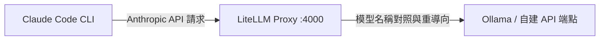

# 在 Claude Code 中使用自訂與本地 LLM 的完整教學指南

本指南將一步一步引導您如何透過 **LiteLLM** 建立一個相容於 Anthropic Messages API 的本地代理伺服器，將 **Claude Code** 的請求路由至自建的 Ollama 本地模型（例如 Qwen-35B 或 Gemma-31B），從而實現使用自訂大語言模型進行開發。

---

## 🏗️ 系統架構簡介



透過修改 Claude Code 的環境變數，將 API 端點指向本地的 LiteLLM 代理伺服器。LiteLLM 會根據設定檔中的 `model_list`，將 Claude Code 所請求的模型名稱（如 `claude-3-5-sonnet` 或特有的 `claude-opus-4-7`）映射至您自建 of Ollama 模型。

---

## 📋 步驟一：準備本地模型（以 Ollama 為例）

在開始設定代理伺服器之前，請確保您的本地 Ollama 服務已啟動，且已下載所需的模型：
- 本地 Ollama 預設監聽端點為：`http://127.0.0.1:11434`
- 常用推薦模型：`qwen2.5-coder`、`gemma2` 等。

> [!NOTE]
> 本指南假設您的本地或自建 API 端點已正常運作，以下將不深入探討 Ollama 的架構安裝。

---

## 🛠️ 步驟二：安裝 LiteLLM

LiteLLM 是一個強大的模型 I/O 庫，支援將數十種不同的模型服務轉譯為 OpenAI 或 Anthropic 的標準 API 格式。

1. **安裝 Python 套件**：
   在系統中使用 `pip` 安裝 LiteLLM 以及代理伺服器相關套件：
   ```bash
   pip install 'litellm[proxy]'
   ```

2. **驗證安裝**：
   確保 `litellm` 指令可在終端機中正確執行：
   ```bash
   litellm --version
   ```

---

## ⚙️ 步驟三：建立 LiteLLM 設定檔

建立一個名為 `config.yml` 的設定檔，定義模型映射規則。

> [!IMPORTANT]
> 由於 Claude Code 在不同功能與運行模式下，會分別請求特定模型（如 `claude-3-5-sonnet` 、 `claude-3-7-sonnet` ，甚至是 `claude-opus-4-7` 或 `claude-opus-4-6[1m]` 等特殊型號），因此我們必須在 `config.yml` 中將這些名稱完整映射至您的自建模型，以避免 Anthropic 原生 API 報錯。

建立並編輯 `config.yml` 檔案：

```yaml
model_list:
  # 1. 核心程式碼處理大腦（映射 Claude Code 預設的 Sonnet 系列請求）
  - model_name: claude-3-7-sonnet
    litellm_params:
      model: openai/qwen3.6:35b-a3b-coding-mxfp8          # 您的本地或自建模型名稱
      api_base: https://your-custom-endpoint/ollama/v1    # 自建 Ollama 或 API 基礎端點
      api_key: "your-api-key"                            # 若無金鑰可隨意填寫 dummy 值

  - model_name: claude-3-7-sonnet-20250219
    litellm_params:
      model: openai/qwen3.6:35b-a3b-coding-mxfp8
      api_base: https://your-custom-endpoint/ollama/v1
      api_key: "your-api-key"

  - model_name: claude-3-5-sonnet
    litellm_params:
      model: openai/qwen3.6:35b-a3b-coding-mxfp8
      api_base: https://your-custom-endpoint/ollama/v1
      api_key: "your-api-key"

  - model_name: claude-3-5-sonnet-20241022
    litellm_params:
      model: openai/qwen3.6:35b-a3b-coding-mxfp8
      api_base: https://your-custom-endpoint/ollama/v1
      api_key: "your-api-key"

  - model_name: claude-sonnet-4-6
    litellm_params:
      model: openai/qwen3.6:35b-a3b-coding-mxfp8
      api_base: https://your-custom-endpoint/ollama/v1
      api_key: "your-api-key"

  # 2. 超複雜邏輯或高精度任務大腦（映射 Opus 系列請求）
  - model_name: claude-opus-4-7
    litellm_params:
      model: openai/gemma4:31b-it-bf16
      api_base: https://your-custom-endpoint/ollama/v1
      api_key: "your-api-key"

  - model_name: claude-opus-4.7
    litellm_params:
      model: openai/gemma4:31b-it-bf16
      api_base: https://your-custom-endpoint/ollama/v1
      api_key: "your-api-key"

  - model_name: "claude-opus-4-6[1m]"
    litellm_params:
      model: openai/gemma4:31b-it-bf16
      api_base: https://your-custom-endpoint/ollama/v1
      api_key: "your-api-key"

  - model_name: claude-opus-4-6
    litellm_params:
      model: openai/gemma4:31b-it-bf16
      api_base: https://your-custom-endpoint/ollama/v1
      api_key: "your-api-key"

  - model_name: claude-3-7-opus
    litellm_params:
      model: openai/gemma4:31b-it-bf16
      api_base: https://your-custom-endpoint/ollama/v1
      api_key: "your-api-key"

  - model_name: claude-3-5-opus
    litellm_params:
      model: openai/gemma4:31b-it-bf16
      api_base: https://your-custom-endpoint/ollama/v1
      api_key: "your-api-key"

  # 3. 速度型背景助理（映射 Haiku 系列請求，例如背景摘要）
  - model_name: claude-3-5-haiku
    litellm_params:
      model: openai/gemma4:e4b
      api_base: https://your-custom-endpoint/ollama/v1
      api_key: "your-api-key"

  - model_name: claude-haiku-4-5
    litellm_params:
      model: openai/gemma4:e4b
      api_base: https://your-custom-endpoint/ollama/v1
      api_key: "your-api-key"
```

---

## 🚀 步驟四：啟動 LiteLLM 代理伺服器

執行以下指令啟動 LiteLLM Proxy，並使其在背景執行：

```bash
nohup litellm --config config.yml --port 4000 > litellm.log 2>&1 &
```

- `--config`: 指定您的 YAML 設定檔路徑。
- `--port`: 監聽連接埠（本例設為 `4000`）。
- 您可以檢查 `litellm.log` 以確保代理服務已正確加載所有模型映射。

---

## ⚙️ 步驟五：修改 Claude Code 設定

最後一步是通知 Claude Code 將所有流量導向剛建立的本地 `localhost:4000` 連接埠。

1. **尋找設定檔位置**：
   Claude Code 的全域設定檔通常儲存在使用者家目錄下的隱藏資料夾中：
   - 檔案路徑：`~/.claude/settings.json`（若檔案不存在，請手動建立）。

2. **編輯設定檔**：
   在 `settings.json` 中配置 `env` 環境變數，重導向 `ANTHROPIC_BASE_URL`，並設定一組虛擬的 `ANTHROPIC_API_KEY`：

   ```json
   {
     "theme": "dark",
     "env": {
       "ANTHROPIC_BASE_URL": "http://localhost:4000",
       "ANTHROPIC_API_KEY": "sk-dummy",
       "CLAUDE_CODE_ENABLE_GATEWAY_MODEL_DISCOVERY": "1"
     }
   }
   ```

   - `"ANTHROPIC_BASE_URL"`: 指向 LiteLLM 監聽的本地代理服務。
   - `"ANTHROPIC_API_KEY"`: 填入任意虛擬金鑰（LiteLLM 本地解析時不需要驗證真正的 Anthropic 金鑰）。
   - `"CLAUDE_CODE_ENABLE_GATEWAY_MODEL_DISCOVERY"`: 設定為 `"1"` 以便 Claude Code 能正確讀取本地 Gateway 暴露的模型列表。

---

## 🎯 步驟六：驗證與運行

現在，開啟您的專案目錄並正常啟動 Claude Code：

```bash
claude
```

LiteLLM 的終端或日誌應會顯示請求被接收並分流：
- 當 Claude Code 內部以 `claude-3-7-sonnet` 發送請求時，LiteLLM 會接收該請求並在底層將其轉換成向本地 Ollama 請求的 `openai/qwen3.6` 程式。
- 所有輸出與工具呼叫將會無縫接軌，實現流暢的本地化大型語言模型開發體驗。
