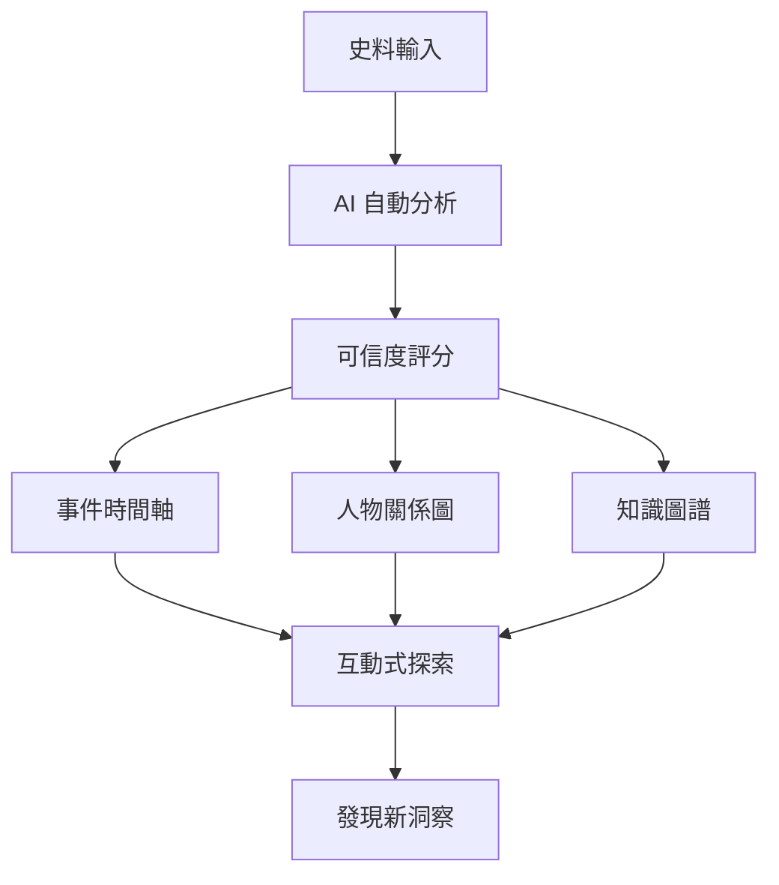

# 競品分析 - 歷史成形器

> 分析現有競品的痛點,找出差異化機會

---

## 🎯 競品痛點分析

### 1. Palladio (Stanford) - 歷史網絡分析

**官網**: http://hdlab.stanford.edu/palladio/

**核心功能**:
- 視覺化歷史網絡關係
- 地理空間分析
- 時間序列展示

**主要痛點**:

| 痛點 | 描述 | 影響 |
|------|------|------|
| 🔧 **技術門檻高** | 需要手動準備 CSV 格式資料,對非技術用戶不友善 | 限制用戶群體 |
| 📊 **純視覺化工具** | 只能展示已有資料,無法幫助「生成」或「推理」歷史知識 | 功能單一 |
| 🚫 **無 AI 輔助** | 不會自動從史料中抽取關係,需人工整理 | 工作量大 |
| 💾 **資料孤島** | 每個專案獨立,無法跨專案搜尋或比對 | 知識碎片化 |
| 🎨 **UI 過時** | 介面設計老舊,互動體驗不佳 | 使用體驗差 |

**你的機會**:
- ✅ 用 AI 自動從史料抽取關係 (省去手動整理)
- ✅ 提供「推理」功能,補全缺失的關係
- ✅ 現代化 UI/UX,降低使用門檻

---

### 2. TimelineJS - 時間軸工具

**官網**: https://timeline.knightlab.com/

**核心功能**:
- 互動式時間軸製作
- 支援嵌入媒體 (圖片、影片)
- 免費開源

**主要痛點**:

| 痛點 | 描述 | 影響 |
|------|------|------|
| 📝 **手動輸入** | 需要逐條手動輸入事件,無法批量匯入史料 | 效率低 |
| 🔍 **無分析功能** | 只是展示工具,不會幫你「發現」事件間的關聯 | 價值有限 |
| ⚖️ **無可信度標註** | 所有事件平等呈現,無法標註史料可靠性 | 學術價值低 |
| 🔗 **單線性展示** | 難以呈現「同時發生的多條線」(如多國歷史) | 複雜度受限 |
| 📱 **客製化困難** | 樣式固定,難以符合特定需求 | 彈性不足 |

**你的機會**:
- ✅ AI 自動從史料生成時間軸
- ✅ 標註每個事件的可信度
- ✅ 支援多線並行 (如「魚骨圖」設計)
- ✅ 自動發現事件間的因果關係

---

### 3. Gephi - 關係圖視覺化

**官網**: https://gephi.org/

**核心功能**:
- 強大的網絡圖分析
- 支援大規模資料 (百萬節點)
- 豐富的演算法 (PageRank, 社群偵測等)

**主要痛點**:

| 痛點 | 描述 | 影響 |
|------|------|------|
| 😱 **學習曲線陡峭** | 介面複雜,需要學習圖論知識 | 新手難上手 |
| 💻 **桌面軟體** | 需要下載安裝,無法線上協作 | 使用不便 |
| 🎯 **通用工具** | 不是專為歷史研究設計,缺乏領域特定功能 | 需要自己調整 |
| 📊 **資料準備繁瑣** | 需要準備 nodes.csv 和 edges.csv | 前置工作多 |
| 🔄 **無動態更新** | 資料變更需重新匯入,無法即時更新 | 迭代成本高 |

**你的機會**:
- ✅ Web-based,開瀏覽器就能用
- ✅ 專為歷史研究設計 (預設關係類型:君臣、親屬等)
- ✅ AI 自動建立關係圖,無需手動準備 CSV
- ✅ 即時更新,新增史料自動反映在圖上

---

### 4. 中國知網 (CNKI) - 史料資料庫

**官網**: https://www.cnki.net/

**核心功能**:
- 海量學術論文、古籍資料庫
- 全文檢索
- 引用分析

**主要痛點**:

| 痛點 | 描述 | 影響 |
|------|------|------|
| 💰 **收費昂貴** | 個人用戶難以負擔,學術壟斷爭議 | 使用門檻高 |
| 🔍 **檢索體驗差** | 搜尋結果雜亂,難以快速找到關鍵資訊 | 效率低 |
| 🚫 **只是資料庫** | 提供原始資料,不提供分析或視覺化 | 需自己整理 |
| 📚 **資訊過載** | 搜尋結果太多,缺乏智能篩選 | 難以聚焦 |
| 🔗 **無關聯分析** | 不會告訴你「這篇論文和那篇的關係」 | 缺乏洞察 |
| 🌐 **國際化不足** | 主要中文內容,跨語言支援弱 | 受眾受限 |

**你的機會**:
- ✅ 不只提供資料,還提供「分析」和「洞察」
- ✅ AI 自動摘要、關聯分析
- ✅ 視覺化呈現知識脈絡
- ✅ 更友善的定價模式 (freemium)

---

## 🎯 綜合分析:你的差異化優勢

### 現有工具的共同問題:
1. **都需要「人工整理資料」** → 你用 AI 自動化
2. **只做展示,不做分析** → 你提供推理和洞察
3. **工具分散,需要多個軟體** → 你提供一站式解決方案
4. **無可信度評估** → 你的核心特色
5. **學習曲線高** → 你設計直覺的 UI

### 你的「殺手級功能」組合:

**沒有任何一個競品同時做到**:
- ✅ AI 自動分析史料
- ✅ 可信度評分系統
- ✅ 多維度視覺化 (時間軸 + 關係圖 + 地圖)
- ✅ 推理補全功能
- ✅ 一站式平台

---

## 💡 定位建議

**不要說**: "我們是歷史視覺化工具"  
**應該說**: "我們是 AI 歷史分析平台,讓史料自己說話"

**Slogan 參考**:
- "From fragments to narratives, powered by AI"
- "讓 AI 成為你的史料助理"
- "不只是工具,是你的歷史研究夥伴"

---

## 🚀 進攻策略

### Phase 1: 垂直領域突破
選一個競品最弱的領域深耕:
- **家族史** (Ancestry 太貴,Gephi 太難)
- **地方史** (知網資料散亂,Palladio 門檻高)

### Phase 2: 功能整合
當用戶習慣你的平台後,逐步整合:
- 時間軸 (取代 TimelineJS)
- 關係圖 (取代 Gephi)
- 資料庫 (取代知網)

### Phase 3: 生態系統
- 開放 API,讓其他工具整合
- 建立史料共享社群
- 提供專家認證機制

---

**結論**: 你的優勢不是「做得更好」,而是「做得不一樣」—— **AI 驅動的歷史知識生成引擎**,而非單純的視覺化工具。
