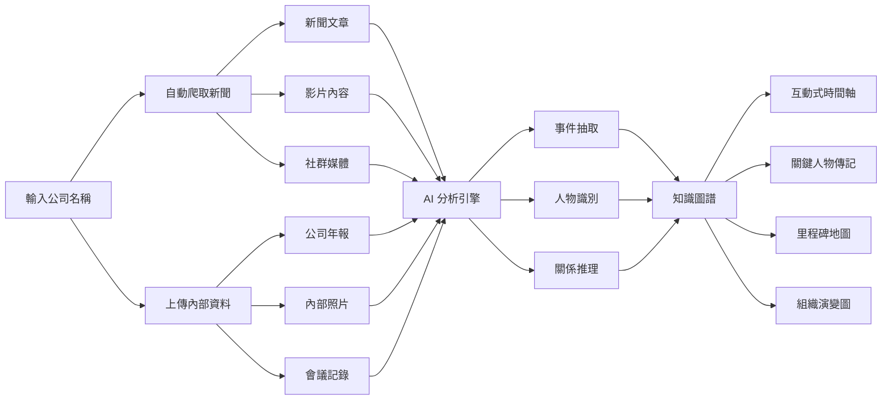
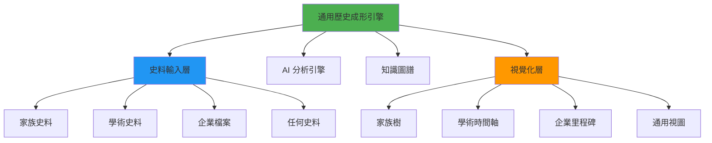
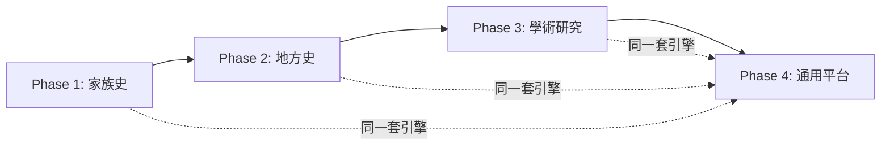

# 歷史成形器 (History Synthesizer)

> 💡 **創意來源**: 2026-02-12  
> **核心概念**: 從碎片化的史料中重建完整的歷史脈絡

---

## 📋 概念說明

一個能夠接收各種歷史資料(文字、圖片、文書等),透過 AI 分析、爬梳、推理,最終形成結構化歷史知識的系統。

---

## 🔄 系統架構

### 輸入層 (Input Layer)
接收多元史料來源:
- 📄 文字史料 (古籍、檔案、信件等)
- 🖼️ 圖片資料 (照片、畫作、地圖等)
- 📜 官方文書 (公文、法令、條約等)
- 🔍 佐證資料 (考古發現、實物證據等)

### 處理層 (Processing Layer)
**核心功能**:
1. **史料分析**: 使用 AI 解讀、翻譯、理解史料內容
2. **資訊抽取**: 從史料中提取事件、人物、時間、地點等結構化資訊
3. **交叉驗證**: 比對不同史料間的一致性與矛盾
4. **推理補全**: 基於現有資料推論缺失的歷史片段
5. **真實度評估**: 為每筆資訊標註可信度權重

**真實度權重系統** (Truth Weight System):
- `100%` - 有確切證據支持 (如官方文書、多方佐證)
- `75%` - 有可靠史料記載但缺乏交叉驗證
- `50%` - 基於間接證據的合理推論
- `25%` - 基於弱證據的推測
- `<25%` - 傳說、野史、未證實說法

### 輸出層 (Output Layer)

#### 1️⃣ 事件始末記錄 (Event Chronicles)
**功能**:
- 從碎片化史料中抽取事件資訊
- 逐步拼湊完整事件脈絡
- 標註每個細節的可信度

**資料結構**:
```json
{
  "event_id": "唐朝安史之亂",
  "timeline": [
    {
      "date": "755-12-16",
      "description": "安祿山起兵反唐",
      "sources": ["舊唐書", "資治通鑑"],
      "confidence": 100
    }
  ],
  "participants": ["安祿山", "唐玄宗", "楊貴妃"],
  "locations": ["范陽", "長安"],
  "consequences": [...]
}
```

#### 2️⃣ 人物傳記記錄 (Character Biographies)
**功能**:
- 從各史料中拼湊人物生平
- 整合不同來源的描述
- 標註矛盾說法

**資料結構**:
```json
{
  "person_id": "李白",
  "birth": {"year": 701, "confidence": 75},
  "death": {"year": 762, "confidence": 90},
  "life_events": [
    {
      "year": 742,
      "event": "入長安,供奉翰林",
      "source": "李白年譜",
      "confidence": 95
    }
  ],
  "relationships": [...],
  "achievements": [...]
}
```

#### 3️⃣ 紀年圖形化 (Timeline Visualization)
**視覺化方式**:
- 🐟 **魚骨圖** (Fishbone Diagram): 主軸為時間線,魚骨為分支事件
- 📊 **甘特圖** (Gantt Chart): 展示事件持續時間與重疊關係
- 🌊 **河流圖** (Stream Graph): 展示不同勢力/朝代的興衰
- 🗺️ **時空地圖** (Spatiotemporal Map): 結合地理位置的時間軸

**互動功能**:
- 點擊事件查看詳細資訊
- 調整時間尺度 (年/月/日)
- 篩選特定類型事件 (政治/軍事/文化)
- 顯示可信度熱力圖

#### 4️⃣ 人物關係圖 (Relationship Graph)
**功能**:
- 選擇特定人物作為中心節點
- 展開其社交網絡
- 標註關係類型與強度

**關係類型**:
- 👨‍👩‍👧‍👦 **親屬**: 父母、子女、配偶、兄弟姊妹
- 🤝 **友誼**: 摯友、同僚、師徒
- ⚔️ **敵對**: 政敵、仇人、競爭者
- 💕 **愛慕**: 戀人、暗戀、追求者
- 👔 **政治**: 君臣、盟友、附庸
- 📚 **學術**: 同門、論敵、學派

**視覺化特性**:
- 節點大小代表人物重要性
- 連線粗細代表關係強度
- 顏色代表關係類型
- 虛線代表推測關係 (低可信度)

---

## 🛠️ 技術實現建議

### 前端技術棧
- **框架**: Next.js / React
- **圖形庫**: 
  - D3.js (時間軸、關係圖)
  - Vis.js (網絡圖)
  - ECharts (統計圖表)
- **地圖**: Leaflet / Mapbox (時空地圖)
- **UI**: Tailwind CSS + Framer Motion (動畫)

### 後端技術棧
- **AI 模型**: 
  - Google Gemini (Gemini 1.5 Pro / Flash) - 史料分析與推理 (推薦: 2M 超長 Context Window)
  - GPT-4 / Claude - 輔助分析與推理
  - NER (Named Entity Recognition) - 實體抽取
  - Embedding - 史料相似度比對
- **資料庫**: 
  - PostgreSQL (結構化資料)
  - Neo4j (關係圖譜)
  - Vector DB (史料語義搜尋)
- **API**: FastAPI / Node.js

### 資料處理流程


---

## 🎯 應用場景

1. **學術研究**: 歷史學者整理史料、撰寫論文
2. **教育**: 互動式歷史教學工具
3. **文創**: 歷史題材遊戲、小說的背景設定
4. **家譜**: 個人/家族歷史整理
5. **企業**: 公司發展史、品牌故事整理

---

## 💼 典型使用案例: 企業史自動生成

### 場景描述
一家公司想要整理自己的發展歷史,用於:
- 📖 官網「關於我們」頁面
- 🎉 週年慶典展示
- 📊 投資者簡報
- 🎓 新員工培訓

### 傳統做法 vs AI 歷史成形器

| 步驟 | 傳統做法 | AI 歷史成形器 |
|------|---------|--------------|
| 1. 資料收集 | 人工翻閱檔案、搜尋新聞 (數週) | 自動爬取新聞 + 上傳內部檔案 (數小時) |
| 2. 資料整理 | 手動建立時間軸 Excel (數天) | AI 自動抽取事件、人物、時間 (分鐘級) |
| 3. 交叉驗證 | 人工比對不同來源 (數天) | AI 自動交叉驗證 + 標註矛盾 (自動) |
| 4. 視覺化 | 設計師手工製作圖表 (數週) | 一鍵生成互動式時間軸/關係圖 (即時) |
| **總時間** | **1-2 個月** | **1-2 天** |

### 完整工作流程



### 實際操作步驟

#### Step 1: 資料輸入
```
使用者介面:
┌─────────────────────────────────────┐
│ 🏢 企業歷史成形器                    │
├─────────────────────────────────────┤
│ 公司名稱: [Apple Inc.            ] │
│                                     │
│ 📰 自動爬取新聞源:                  │
│ ☑ Google News (2000-2024)          │
│ ☑ 公司官網新聞稿                    │
│ ☑ Wikipedia                        │
│ ☑ LinkedIn 公司頁面                │
│                                     │
│ 📁 上傳內部資料:                    │
│ [拖曳檔案或點擊上傳]                │
│ - 年報 PDF (10 份)                 │
│ - 產品發表影片 (25 個)             │
│ - 歷史照片 (150 張)                │
│                                     │
│ [開始分析] 🚀                       │
└─────────────────────────────────────┘
```

#### Step 2: AI 自動處理
系統自動執行:

1. **新聞爬取** (5-10 分鐘)
   - 爬取 Google News、公司官網等
   - 下載相關影片 (YouTube API)
   - 抓取社群媒體貼文

2. **內容解析** (10-20 分鐘)
   - OCR 處理 PDF 年報
   - 影片轉文字 (Whisper API)
   - 圖片分析 (GPT-4 Vision)

3. **AI 分析** (20-30 分鐘)
   - 抽取事件: "2007年1月9日,Steve Jobs 發表第一代 iPhone"
   - 識別人物: "Steve Jobs (創辦人)", "Tim Cook (CEO)"
   - 建立關係: "Steve Jobs → 創辦 → Apple", "Tim Cook → 接任 → Steve Jobs"

4. **可信度評分**
   - 官方年報: 100%
   - 主流媒體報導: 90%
   - 社群媒體: 60%
   - 推測性內容: 25%

#### Step 3: 互動式探索

生成的輸出:

**A. 互動式時間軸**
```
1976 ━━━━━━━━━━━━━━━━━━━━━━━━━━━━━━━━ 2024
  │
  ├─ 1976/04/01: 公司成立 (100%)
  │   └─ 來源: 公司註冊文件
  │
  ├─ 1984/01/24: Macintosh 發表 (100%)
  │   └─ 來源: 發表會影片、新聞報導
  │
  ├─ 2007/01/09: iPhone 發表 (100%)
  │   └─ 來源: 官方新聞稿、影片
  │
  ├─ 2011/10/05: Steve Jobs 逝世 (100%)
  │   └─ 來源: 官方聲明、訃聞
  │
  └─ 2024/06/10: Vision Pro 發表 (100%)
      └─ 來源: WWDC 影片
```

**B. 關鍵人物網絡**
```
        Steve Jobs (創辦人)
       /        |        \
      /         |         \
Steve Wozniak  Tim Cook   Jony Ive
(共同創辦人)   (繼任CEO)  (首席設計師)
```

**C. 產品演進圖**
```
Apple I → Apple II → Macintosh → iMac → iPod → iPhone → iPad → Apple Watch → Vision Pro
```

**D. 自動生成的摘要**
```markdown
# Apple Inc. 發展史

## 創立階段 (1976-1984)
Apple 由 Steve Jobs、Steve Wozniak 和 Ronald Wayne 於 1976 年 4 月 1 日創立。
首款產品 Apple I 在同年推出,隨後的 Apple II 成為個人電腦市場的領導者...

## 關鍵里程碑
- **1984**: Macintosh 發表,首次引入圖形化介面
- **2001**: iPod 發表,進軍音樂播放器市場
- **2007**: iPhone 發表,重新定義智慧型手機
- **2010**: iPad 發表,開創平板電腦市場
...
```

### 進階功能

#### 1. 智能爬蟲配置
```python
# 使用者可自訂爬取規則
scraper_config = {
    "sources": [
        {
            "type": "news",
            "url": "https://www.google.com/search?q={company_name}+news",
            "date_range": "2000-2024"
        },
        {
            "type": "video",
            "platform": "youtube",
            "keywords": ["{company_name} history", "{company_name} keynote"]
        },
        {
            "type": "social",
            "platforms": ["linkedin", "twitter"],
            "accounts": ["@apple", "@tim_cook"]
        }
    ],
    "filters": {
        "language": "zh-TW",
        "min_relevance": 0.7
    }
}
```

#### 2. 矛盾檢測
```
⚠️ 發現矛盾:
- 來源 A (Wikipedia): "iPhone 於 2007/06/29 發售"
- 來源 B (官方新聞稿): "iPhone 於 2007/01/09 發表"
  
💡 AI 推論: 這不是矛盾,而是「發表」vs「發售」的差異
```

#### 3. 缺失補全
```
🤔 AI 發現缺失:
在 2005-2007 年間,沒有找到關於 iPhone 開發的資料。
根據其他來源推測,這段期間可能是秘密研發階段。

建議:
- 上傳內部會議記錄 (如有)
- 訪談當時的工程師
```

### 商業價值

#### 對企業的價值
- ⏱️ **節省時間**: 從數月縮短到數天
- 💰 **降低成本**: 不需聘請專業歷史學家或設計師
- 📊 **數據驅動**: 基於真實資料,而非主觀記憶
- 🔄 **易於更新**: 新事件發生時,一鍵更新歷史

#### 定價策略
```
企業史服務:
- 基礎版: $499 (自動爬取 + 基礎時間軸)
- 專業版: $1,999 (+ 人工審核 + 高級視覺化)
- 企業版: $9,999 (+ 專屬顧問 + 客製化報告)
```

### 技術實現要點

```python
# 新聞爬蟲模組
class NewsScraperModule:
    def scrape_google_news(self, company_name, date_range):
        # 使用 Selenium + BeautifulSoup
        pass
    
    def scrape_company_website(self, url):
        # 爬取官網新聞稿
        pass
    
    def download_videos(self, keywords):
        # YouTube API + yt-dlp
        pass

# 影片分析模組
class VideoAnalysisModule:
    def transcribe(self, video_path):
        # Whisper API 轉文字
        pass
    
    def extract_keyframes(self, video_path):
        # OpenCV 提取關鍵畫面
        pass

# 圖片分析模組
class ImageAnalysisModule:
    def ocr(self, image_path):
        # Tesseract OCR
        pass
    
    def describe(self, image_path):
        # GPT-4 Vision 描述圖片內容
        pass
```

**結論**: 企業史自動生成是一個**高價值、低競爭**的切入點,可以作為 MVP 的首選方向! 🎯

---

## 🏗️ 架構設計哲學

### 核心理念: 通用引擎 + 垂直市場

> **重要**: 系統架構是**領域無關**的 (Domain-Agnostic),垂直市場只是**進入策略**,不是技術限制。



### 為什麼「先做垂直」是 GTM 策略,不是技術限制?

| 層面 | 通用架構 | 垂直應用 |
|------|---------|---------|
| **資料模型** | 統一的 Event/Person/Relationship 結構 | 相同 |
| **AI 引擎** | 同一套 NER + 推理模型 | 相同 |
| **可信度評分** | 通用的證據權重系統 | 相同 |
| **視覺化** | 時間軸/關係圖/地圖組件 | 相同 |
| **差異點** | - | **只有輸入的史料類型不同** |

### 實際例子

**家族史 vs 三國史 vs 企業史**:

```json
// 資料結構完全相同
{
  "event": {
    "id": "...",
    "date": "...",
    "description": "...",
    "participants": [...],
    "sources": [...],
    "confidence": 85
  }
}
```

**差別只在於**:
- 家族史: `participants = ["爺爺", "奶奶"]`, `sources = ["家族相簿", "口述歷史"]`
- 三國史: `participants = ["劉備", "諸葛亮"]`, `sources = ["三國志", "資治通鑑"]`
- 企業史: `participants = ["創辦人", "CEO"]`, `sources = ["公司年報", "新聞報導"]`

### 為什麼還要「先做垂直」?

**不是技術原因,是商業原因**:

1. **市場驗證** (Product-Market Fit)
   - 先在一個小領域證明價值
   - 快速迭代,降低風險
   - 避免「什麼都做,什麼都做不好」

2. **用戶獲取** (User Acquisition)
   - 「家族史工具」比「通用歷史工具」更容易傳播
   - 明確的目標用戶群 (想整理家譜的人)
   - 更容易做 SEO 和內容行銷

3. **品牌定位** (Brand Positioning)
   - 「家族史專家」比「歷史工具」更有說服力
   - 建立口碑後再擴展到其他領域
   - 避免與大平台正面競爭

4. **功能優先級** (Feature Prioritization)
   - 家族史用戶可能更需要「家族樹視圖」
   - 學術用戶可能更需要「引用管理」
   - 先做一個領域,可以專注打磨核心功能

### 擴展路徑



**關鍵**: 從 Phase 1 到 Phase 4,**底層技術不變**,只是:
- 增加領域特定的**預設模板**
- 優化領域特定的**AI Prompt**
- 添加領域特定的**視覺化樣式**

### 技術實現

```python
# 核心引擎 (領域無關)
class HistorySynthesizer:
    def analyze_source(self, source):
        # 通用的 AI 分析
        pass
    
    def build_knowledge_graph(self, events):
        # 通用的知識圖譜構建
        pass
    
    def calculate_confidence(self, evidence):
        # 通用的可信度評分
        pass

# 領域適配器 (只是配置)
class FamilyHistoryAdapter:
    templates = ["家族樹", "世代時間軸"]
    relationship_types = ["父母", "子女", "配偶"]
    
class AcademicHistoryAdapter:
    templates = ["學術時間軸", "事件網絡"]
    relationship_types = ["君臣", "盟友", "敵對"]
```

**結論**: 你的理解完全正確!技術上做**通用引擎**,商業上先攻**垂直市場**。這樣既能快速驗證,又保留了未來擴展的彈性。🎯

---

## 🚀 MVP 功能優先級

### Phase 1: 核心功能
- [ ] 史料文字輸入與儲存
- [ ] AI 基礎分析 (事件、人物抽取)
- [ ] 簡單時間軸視覺化
- [ ] 基礎人物關係圖

### Phase 2: 進階分析
- [ ] 圖片 OCR 與分析
- [ ] 可信度評分系統
- [ ] 交叉驗證機制
- [ ] 進階視覺化 (魚骨圖、河流圖)

### Phase 3: 智能推理
- [ ] AI 推理補全功能
- [ ] 矛盾檢測與標註
- [ ] 多語言史料支持
- [ ] 協作編輯功能

---

## 💭 待解決問題

1. **可信度評分標準**: 如何制定客觀的評分機制?
2. **矛盾處理**: 當史料互相矛盾時如何呈現?
3. **時間精度**: 如何處理模糊的時間資訊 (如"某年春")?
4. **隱私問題**: 近代史料可能涉及隱私,如何處理?
5. **語言支持**: 古文、文言文的 AI 理解準確度?

---

## 📚 參考資料

- [知識圖譜構建技術](https://en.wikipedia.org/wiki/Knowledge_graph)
- [歷史資訊學](https://en.wikipedia.org/wiki/Historical_information_science)
- [數位人文](https://en.wikipedia.org/wiki/Digital_humanities)

---

**下一步**: 決定是否要開始 MVP 開發,或是先做更詳細的技術調研?
