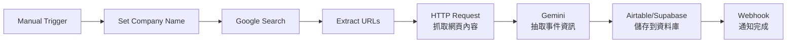
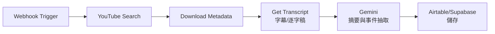
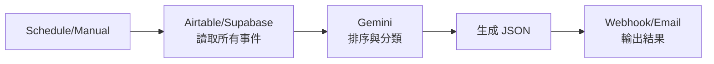

# 歷史成形器 - n8n POC 實現方案

> 使用 n8n 快速驗證「企業史自動生成」概念

---

## 🎯 為什麼用 n8n?

### 優勢
- ✅ **快速原型**: 無需寫代碼,拖拉即可建立工作流
- ✅ **豐富整合**: 內建 Google Gemini、YouTube、SerpAPI 等 API
- ✅ **視覺化**: 工作流程一目了然,易於調整
- ✅ **已部署**: 你已經有 n8n 在 `https://n8n.milkcat.org`
- ✅ **成本低**: 快速驗證想法,不需大量開發

### 限制
- ⚠️ 複雜的 AI 推理可能需要自訂節點
- ⚠️ 大規模資料處理效能有限
- ⚠️ 視覺化輸出需要額外開發

**結論**: n8n 非常適合做 **MVP/POC**,驗證核心流程後再決定是否要自己開發完整系統。

---

## 🔄 n8n 工作流設計

### Workflow 1: 企業新聞爬取與分析



### Workflow 2: YouTube 影片分析



### Workflow 3: 時間軸生成



---

## 📋 詳細 n8n 節點配置

### Workflow 1: 企業新聞爬取

#### 節點 1: Manual Trigger
```json
{
  "name": "Start",
  "type": "n8n-nodes-base.manualTrigger"
}
```

#### 節點 2: Set Company Name
```json
{
  "name": "Set Variables",
  "type": "n8n-nodes-base.set",
  "parameters": {
    "values": {
      "string": [
        {
          "name": "company_name",
          "value": "Apple Inc."
        },
        {
          "name": "date_range",
          "value": "2020-2024"
        }
      ]
    }
  }
}
```

#### 節點 3: Google Search (使用 SerpAPI 或 HTTP Request)
```json
{
  "name": "Google Search",
  "type": "n8n-nodes-base.httpRequest",
  "parameters": {
    "url": "https://serpapi.com/search",
    "method": "GET",
    "queryParameters": {
      "parameters": [
        {
          "name": "q",
          "value": "={{ $json.company_name }} news"
        },
        {
          "name": "api_key",
          "value": "YOUR_SERPAPI_KEY"
        },
        {
          "name": "num",
          "value": "10"
        }
      ]
    }
  }
}
```

#### 節點 4: Extract URLs
```json
{
  "name": "Extract URLs",
  "type": "n8n-nodes-base.code",
  "parameters": {
    "jsCode": "const results = $input.item.json.organic_results;\nconst urls = results.map(r => ({\n  url: r.link,\n  title: r.title,\n  snippet: r.snippet,\n  date: r.date\n}));\nreturn urls.map(u => ({ json: u }));"
  }
}
```

#### 節點 5: HTTP Request (抓取網頁內容)
```json
{
  "name": "Fetch Page Content",
  "type": "n8n-nodes-base.httpRequest",
  "parameters": {
    "url": "={{ $json.url }}",
    "method": "GET",
    "options": {
      "timeout": 10000
    }
  }
}
```

#### 節點 6: Google Gemini - 抽取事件
```json
{
  "name": "Extract Events with AI",
  "type": "n8n-nodes-base.googleGemini",
  "parameters": {
    "model": "gemini-1.5-pro",
    "messages": {
      "values": [
        {
          "role": "system",
          "content": "你是歷史事件抽取專家。從新聞內容中抽取:\n1. 事件日期 (YYYY-MM-DD)\n2. 事件描述 (簡短)\n3. 相關人物\n4. 事件類型 (產品發表/人事異動/財報/其他)\n\n以 JSON 格式輸出:\n{\n  \"date\": \"...\",\n  \"description\": \"...\",\n  \"people\": [...],\n  \"type\": \"...\",\n  \"confidence\": 0-100\n}"
        },
        {
          "role": "user",
          "content": "新聞標題: {{ $json.title }}\n新聞內容: {{ $json.body }}"
        }
      ]
    }
  }
}
```

#### 節點 7: Supabase - 儲存事件
```json
{
  "name": "Save to Database",
  "type": "n8n-nodes-base.supabase",
  "parameters": {
    "operation": "insert",
    "table": "company_events",
    "data": {
      "company_name": "={{ $('Set Variables').item.json.company_name }}",
      "event_date": "={{ $json.date }}",
      "description": "={{ $json.description }}",
      "people": "={{ JSON.stringify($json.people) }}",
      "event_type": "={{ $json.type }}",
      "confidence": "={{ $json.confidence }}",
      "source_url": "={{ $('Extract URLs').item.json.url }}",
      "source_title": "={{ $('Extract URLs').item.json.title }}"
    }
  }
}
```

---

### Workflow 2: YouTube 影片分析

#### 節點配置

```json
{
  "nodes": [
    {
      "name": "Webhook",
      "type": "n8n-nodes-base.webhook",
      "parameters": {
        "path": "analyze-youtube",
        "method": "POST"
      }
    },
    {
      "name": "YouTube Search",
      "type": "n8n-nodes-base.youTube",
      "parameters": {
        "operation": "search",
        "query": "={{ $json.company_name }} history keynote",
        "maxResults": 10
      }
    },
    {
      "name": "Get Video Details",
      "type": "n8n-nodes-base.youTube",
      "parameters": {
        "operation": "get",
        "videoId": "={{ $json.id.videoId }}"
      }
    },
    {
      "name": "Get Transcript",
      "type": "n8n-nodes-base.httpRequest",
      "parameters": {
        "url": "https://www.youtube.com/api/timedtext",
        "queryParameters": {
          "parameters": [
            {
              "name": "v",
              "value": "={{ $json.id.videoId }}"
            },
            {
              "name": "lang",
              "value": "en"
            }
          ]
        }
      }
    },
    {
      "name": "Gemini - Analyze Transcript",
      "type": "n8n-nodes-base.googleGemini",
      "parameters": {
        "model": "gemini-1.5-flash",
        "messages": {
          "values": [
            {
              "role": "system",
              "content": "從影片逐字稿中抽取重要歷史事件,包含日期、描述、人物。"
            },
            {
              "role": "user",
              "content": "影片標題: {{ $json.title }}\n逐字稿: {{ $('Get Transcript').item.json.transcript }}"
            }
          ]
        }
      }
    },
    {
      "name": "Save to Supabase",
      "type": "n8n-nodes-base.supabase",
      "parameters": {
        "operation": "insert",
        "table": "company_events"
      }
    }
  ]
}
```

---

### Workflow 3: 時間軸生成

```json
{
  "nodes": [
    {
      "name": "Manual Trigger",
      "type": "n8n-nodes-base.manualTrigger"
    },
    {
      "name": "Supabase - Get All Events",
      "type": "n8n-nodes-base.supabase",
      "parameters": {
        "operation": "getAll",
        "table": "company_events",
        "filterType": "string",
        "filterString": "company_name=eq.{{ $json.company_name }}"
      }
    },
    {
      "name": "Sort by Date",
      "type": "n8n-nodes-base.sort",
      "parameters": {
        "sortFieldsUi": {
          "sortField": [
            {
              "fieldName": "event_date",
              "order": "ascending"
            }
          ]
        }
      }
    },
    {
      "name": "Gemini - Generate Timeline",
      "type": "n8n-nodes-base.googleGemini",
      "parameters": {
        "model": "gemini-1.5-pro",
        "messages": {
          "values": [
            {
              "role": "system",
              "content": "將事件整理成結構化的時間軸,分階段(創立期/成長期/成熟期),並生成摘要。"
            },
            {
              "role": "user",
              "content": "事件列表: {{ JSON.stringify($input.all()) }}"
            }
          ]
        }
      }
    },
    {
      "name": "Send Email/Webhook",
      "type": "n8n-nodes-base.emailSend",
      "parameters": {
        "subject": "企業歷史時間軸已生成",
        "text": "={{ $json.timeline }}"
      }
    }
  ]
}
```

---

## 🗄️ 資料庫結構 (Supabase)

```sql
-- 公司事件表
CREATE TABLE company_events (
  id UUID PRIMARY KEY DEFAULT gen_random_uuid(),
  company_name TEXT NOT NULL,
  event_date DATE NOT NULL,
  description TEXT NOT NULL,
  people JSONB,
  event_type TEXT,
  confidence INTEGER,
  source_url TEXT,
  source_title TEXT,
  source_type TEXT, -- 'news', 'video', 'image', 'document'
  created_at TIMESTAMP DEFAULT NOW()
);

-- 索引
CREATE INDEX idx_company_name ON company_events(company_name);
CREATE INDEX idx_event_date ON company_events(event_date);
CREATE INDEX idx_confidence ON company_events(confidence);
```

---

## 🚀 POC 實施步驟

### Phase 1: 基礎爬蟲 (1-2 天)
1. ✅ 建立 Workflow 1 (新聞爬取)
2. ✅ 設定 Supabase 資料庫
3. ✅ 測試 Gemini 事件抽取
4. ✅ 驗證資料儲存

### Phase 2: 多來源整合 (2-3 天)
1. ✅ 建立 Workflow 2 (YouTube)
2. ✅ 新增圖片分析 (GPT-4 Vision)
3. ✅ 測試多來源資料整合

### Phase 3: 時間軸生成 (1-2 天)
1. ✅ 建立 Workflow 3 (時間軸)
2. ✅ 設計簡單的輸出格式 (JSON/Markdown)
3. ✅ 測試完整流程

### Phase 4: 前端展示 (3-5 天)
1. ✅ 建立簡單的 Next.js 前端
2. ✅ 連接 Supabase 讀取資料
3. ✅ 使用 D3.js 或 TimelineJS 展示時間軸

**總時間**: 1-2 週完成 POC

---

## 💰 成本估算

### n8n 方案
- n8n 自架: $0 (已有)
- SerpAPI: $50/月 (5000 次搜尋)
- Gemini API: ~$10-30 (Gemini 1.5 Flash 極便宜)
- Supabase: $0 (免費方案)

**總成本**: ~$70-100/月

### 對比自己開發
- 開發時間: 1-2 個月
- 開發成本: $5,000-$10,000 (假設時薪 $50)

**結論**: n8n POC 可以用 1% 的成本驗證 80% 的核心功能!

---

## 🎯 POC 成功指標

### 技術指標
- [ ] 能自動爬取至少 50 條新聞
- [ ] AI 抽取準確率 > 70%
- [ ] 能處理至少 10 個 YouTube 影片
- [ ] 生成的時間軸包含至少 30 個事件

### 商業指標
- [ ] 找 3-5 家公司測試
- [ ] 收集使用者回饋
- [ ] 驗證付費意願 (至少 2 家願意付 $500+)

---

## 🔄 從 POC 到產品

### 如果 POC 成功
1. **保留 n8n**: 作為後端資料處理引擎
2. **開發前端**: 專業的 Web UI
3. **增強 AI**: 訓練專用模型,提高準確率
4. **擴展功能**: 加入更多視覺化、匯出格式

### 如果 POC 失敗
- 低成本驗證,快速轉向
- 保留核心技術,嘗試其他應用場景

---

## 📝 下一步行動

1. **立即開始**: 在你的 n8n 上建立第一個 Workflow
2. **選擇測試公司**: 例如 Apple、Tesla、OpenAI (公開資料多)
3. **設定 Supabase**: 建立資料庫表
4. **測試 API**: 確認 SerpAPI、OpenAI 可用
5. **運行第一次**: 爬取 10 條新聞,看 AI 抽取效果

**預計時間**: 今天就可以看到第一個結果! 🚀

---

要不要現在就開始在你的 n8n 上建立第一個 Workflow? 😊
